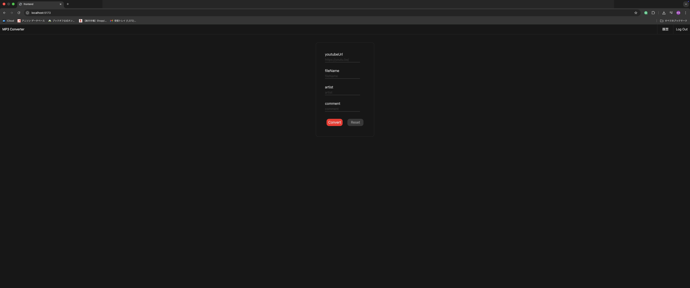
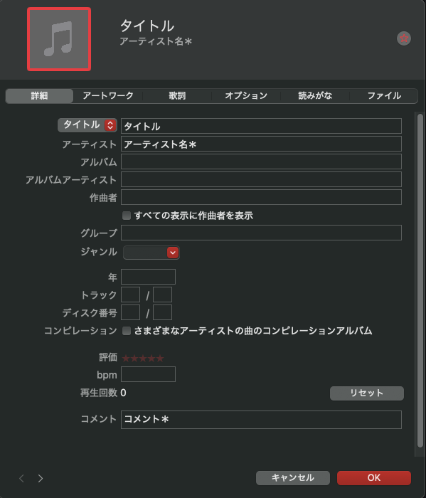
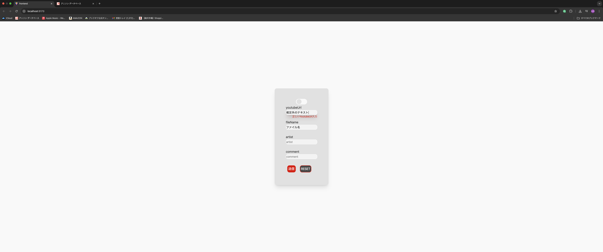

<div id="top"></div>

## 目次

1. [プロジェクトについて](#プロジェクトについて)
2. [外観](#外観)
3. [使用技術一覧](#使用技術一覧)
4. [環境](#環境)
5. [ディレクトリ構成](#ディレクトリ構成)
6. [セットアップ](#セットアップ)
7. [動作確認](#動作確認)

<!-- プロジェクト名 -->

## mp3converter

Mp3converterのリポジトリ

<!-- プロジェクトについて -->

## プロジェクトについて

動画投稿サイトに投稿された動画の音声をmp3としてpcへダウンロードするアプリになります。

＊作成動機は、趣味であるDJプレイで用いる楽曲を極めて個人的にダウンロードする為であり、規約違反を助長する意図は全くありません。

変換機能を搭載したサイトは数おおく存在していますが、タグ書き込み機能が無く、変換時に時間が掛かり、広告が有るのでそれらを解決できるように意識しました。

完全個人利用を想定したものですので、マネタイズに繋がる機能は実装せず、時間と広告の問題はここで解決しました。

<p align="right">(<a href="#top">トップへ</a>)</p>

<!-- 外観 -->

## 外観

主な機能は、MP3変換、テキストリセット機能、バリデート、ダークモード・ライトモードの切り替え。

上部のtoguruボタンを押すことでディスプレイの状態をダーク←→ライトと操作可能。

URL入力欄は規定されたUrlの形式のみ受け付けます。

規定外の入力・未入力を検知するとバリデート機能が作動し、入力したテキストのリセット・警告メッセージが表示されます。

FaileNameも同様に未入力を検知すると警告メッセージが表示されます。

テキスト最後尾に＊がついている部分は入力の有無関係なく変換可能です。

変換ボタンを押下すると変換が開始され、変換終了後はUrlとFileNameの欄に空文字が挿入され入力値がリセットされます。

RESETボタンを押下するとフォームに入力された全テキストを空文字が上書きし入力値がリセットされます。


外観及び変換前のテキストを入力した状態です。


ダークモード



ダウンロード後のmp3タグには対応した箇所に、入力したテキストが挿入されています



規定外のUrl入力を検知した場合



スマホ表示に対応


<p align="right">(<a href="#top">トップへ</a>)</p>

## 使用技術一覧

<!-- シールド一覧 -->
<p style="display: inline">
  <!-- フロントエンド -->
    
    
    
    <!-- バックエンド -->
    
</p>

<p align="right">(<a href="#top">トップへ</a>)</p>

## 環境

<!-- 言語、フレームワークのバージョン -->


| 言語・フレームワーク  | バージョン |
| --------------------- | ---------- |
| Python                | 3.13.7     |
| React                 | 19.2.0     |
| tailwindcss           | 4.1.18     |

### frontend

外枠は、TSX、フォーム部分はTSXとReactHookForm+zodで作成しました。

当初はReactUseReducerでフォームの値を管理していましたが、作成する過程でRHFの方がシンプルかつReactの設計思想に合致しているのでこちらを選びました。
Reducerと比較して、値の管理、バリデートの実装・変更が容易、と同時に、ある程度の型が用意されているRHFは、複雑な実装に向いていないとも感じました。

tailwind-cssではなくtailwind-variantsを選択した理由も同様です。

元々、cssを用いてスタイルを当てていましたが、学習コストが高く時間的制約により、直感的なtailwind-cssに変更。しかしながら、ClassNameが助長になり可読性が落ちてしまった為、最終的にtailwind-variantsを選択。スタイルと対象のTSXを別ファイルで管理したことにより、可読性が向上、直感的に当てているスタイルの確認が可能になり開発の速度が向上しました。

### backend


<p align="right">(<a href="#top">トップへ</a>)</p>

## ディレクトリ構成

<!-- ディレクトリ構造は上下,,,で囲む -->

```
.
├── backend
│   └── app.py
├── frontend
│   ├── eslint.config.js
│   ├── index.html
│   ├── src
│   │   ├── api
│   │   │   └── audioDownloadApi.tsx
│   │   ├── App.tsx
│   │   ├── components
│   │   │   ├── ErrorList.tsx
│   │   │   ├── FormResetButton.tsx
│   │   │   ├── InputForm.tsx
│   │   │   ├── InputFormButton.tsx
│   │   │   ├── InputText.tsx
│   │   │   └── TextForm.tsx
│   │   ├── context
│   │   │   └── DisplayColorContext.ts
│   │   ├── hooks
│   │   │   ├── useConverterHistory.ts
│   │   │   ├── useConvertProgress.ts
│   │   │   ├── useErrorText.ts
│   │   │   └── useFileTextHooks.ts
│   │   ├── index.css
│   │   ├── main.tsx
│   │   ├── tv
│   │   │   ├── app.tv.ts
│   │   │   └── components
│   │   │       ├── button.tv.ts
│   │   │       ├── convertHistory.tv.ts
│   │   │       ├── displayMode.tv.ts
│   │   │       ├── errorList.tv.ts
│   │   │       ├── form
│   │   │       │   ├── errorList.ts
│   │   │       │   ├── inputFormButton.ts
│   │   │       │   └── textForm.ts
│   │   │       ├── formResetButton.tv.ts
│   │   │       └── inputForm.tv.ts
│   │   └── utils
│   │       ├── callApi.ts
│   │       └── schema.ts
│   └── vite.config.ts
└── README.md
```

<p align="right">(<a href="#top">トップへ</a>)</p>

## セットアップ

**frontend**

```bash
npm install
npm run dev
```

**backend**

```bash
pip install -r requirements.txt
python app.py
```

### 動作確認

http://localhost:5173/ にアクセスできるか確認
アクセスできたら成功

<p align="right">(<a href="#top">トップへ</a>)</p>
