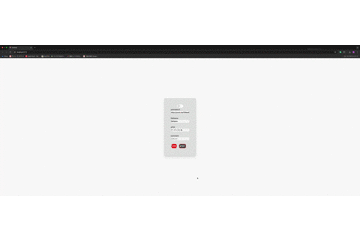
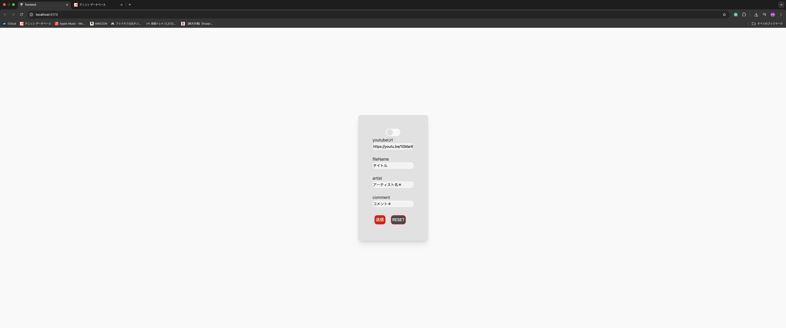
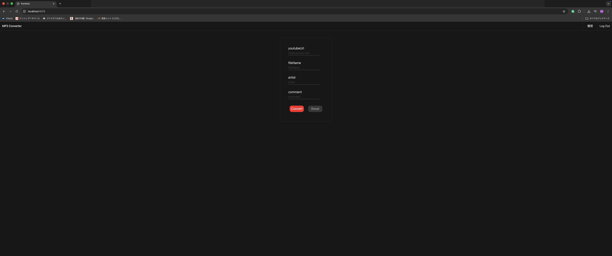
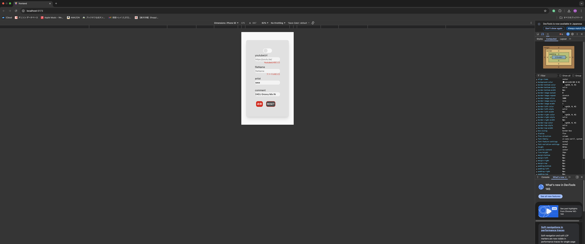

<div id="top"></div>

<!-- プロジェクト名 -->
<h1 align="center">mp3converter (Powered by Docker & Hybrid Backend)</h1>

<p align="center">
  <strong>動画サイトから音声を抽出し、タグ編集・履歴管理まで可能なフルスタックMP3変換ツール</strong>
</p>

## 目次

1. [プロジェクトについて](#プロジェクトについて)
2. [外観](#外観)
3. [使用技術一覧](#使用技術一覧)
4. [ディレクトリ構成](#ディレクトリ構成)
5. [セットアップ](#セットアップ)
6. [動作確認](#動作確認)

---

## プロジェクトについて

YouTube等の動画投稿サイトの音声を抽出し、自動でMP3タグ（タイトル・アーティスト名）を埋め込みながらダウンロードできるアプリケーションです。

### 開発の動機
既存の変換サイトにおける「操作感の悪さ」「タグ書き込み非搭載」「広告の多さ」「変換時間の長さ」といった不満を解消するために制作しました。趣味のDJ活動で必要な楽曲管理を、個人の範囲内でより効率的に行うことを目的としています。

---

## 外観

### デモ


- **MP3変換 & タグ挿入**: 入力された情報を元に、ダウンロード後のファイルに自動でメタ情報を書き込みます。
- **バリデート機能**: React Hook Form + Zod による堅牢な入力チェック。
- **ダークモード対応**: システムや好みに合わせたテーマ切り替え。

- **ユーザー認証**: サインアップとログイン機能ー個々のユーザーが自身のデータを安全に管理可能。
- **変換履歴**: 過去にダウンロードした動画の履歴を保存。いつでも一覧から再アクセス可能。
- **ハイブリッド・バックエンド**:
  - **Node.js/Express**: ユーザー管理、データベース(MongoDB)連携。
  - **Python/Flask**: 音声処理(yt-dlp)とMP3タグ編集(mutagen)。
- **Docker Compose 対応**: 複雑な環境構築を不要にし、コマンド一つで全サービスを起動可能。

<p align="center">
  
  
</p>

- **モバイル対応**: レスポンシブ設計によりスマホからの操作もスムーズです。


<p align="right">(<a href="#top">トップへ</a>)</p>

## 使用技術一覧

### フロントエンド
- **React 19**
- **TypeScript**
- **TailwindCSS 4** (Vite 連携)
- **Tailwind Variants** (スタイル管理)
- **React Router 7**
- **React Hook Form & Zod** (フォーム管理)

### バックエンド (Node.js API)
- **Express 5**
- **MongoDB / Mongoose**
- **JWT / Bcrypt** (認証)

### バックエンド (Python Engine)
- **Flask**
- **Flask-SocketIO / eventlet**
- **yt-dlp** (音声抽出)
- **mutagen** (ID3タグ編集)

### インフラ・その他
- **Docker / Docker Compose**
- **Vite**

<p align="right">(<a href="#top">トップへ</a>)</p>

## ディレクトリ構成

```text
.
├── backend
│   ├── controllers/      # ビジネスロジック
│   ├── models/           # MongoDB スキーマ (User, Post等)
│   ├── routes/           # API エンドポイント
│   ├── app.js            # Node.js メインサーバー (API/Auth)
│   ├── app.py            # Python メインサーバー (Conversion/Socket)
│   ├── Dockerfile.node   # Node.js 用環境定義
│   └── Dockerfile.python # Python 用環境定義
├── frontend
│   ├── src
│   │   ├── api/          # API クライアント
│   │   ├── components/   # 共通コンポーネント
│   │   ├── pages/        # 画面構成 (Main, Login, Signup)
│   │   ├── tv/           # Tailwind Variants スタイル定義
│   │   └── utils/        # 共通ユーティリティ (Zod Schema等)
│   └── Dockerfile        # フロントエンド用環境定義
├── docker-compose.yml    # コンテナオーケストレーション
└── README.md
```

<p align="right">(<a href="#top">トップへ</a>)</p>

## セットアップ

最も簡単な方法は **Docker Compose** を使用することです。

### 推奨: Docker を使用する場合

1. **リポジトリをクローン**
   ```bash
   git clone [repository_url]
   cd youtube-mp3-cucd
   ```

2. **環境変数の設定**
   `backend/.env` を作成し、必要な情報を記載します。
   ```env
   DB_URL=mongodb+srv://... (MongoDB Atlas等のURL)
   JWT_SECRET=your_secret_key
   PORT=5000
   ```

3. **起動**
   ```bash
   docker compose up --build
   ```
   - フロントエンド: http://localhost:5173
   - Node API: http://localhost:5000
   - Python API: http://localhost:5001

---

### 個別にローカルで起動する場合

#### 前提条件
- Node.js v20+
- Python 3.13+
- MongoDB サーバー

#### バックエンド (Node.js)
```bash
cd backend
npm install
node app.js
```

#### バックエンド (Python)
```bash
cd backend
python -m venv venv
source venv/bin/activate # Windows: venv\Scripts\activate
pip install -r requirements.txt
python app.py
```

#### フロントエンド
```bash
cd frontend
npm install
npm run dev
```

<p align="right">(<a href="#top">トップへ</a>)</p>

## 動作確認

1. **サインアップ & ログイン**: ユーザー登録を行いログインします。
2. **URL入力**: 対象の動画URLと、好みのファイル名、アーティスト名を入力。
3. **変換**: 「CONVERT」ボタンをクリック。Socket.io を通じて進捗が表示されます。
4. **ダウンロード**: 完了すると自動的にMP3ファイルが保存されます。
5. **履歴確認**: サイドメニュー（History）から、変換した履歴を確認できます。

<p align="right">(<a href="#top">トップへ</a>)</p>

